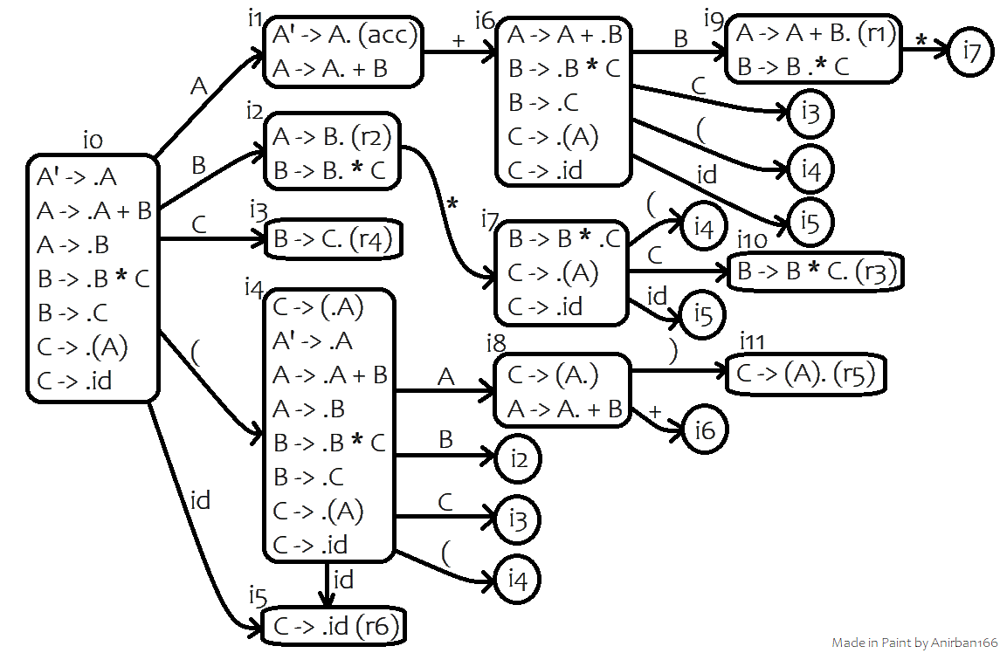

Consider the following context free grammar to be used throughout the parser examples in this readme:
```cpp
Variables, V = {A, B, C} 
Terminals, T = {+, *, (, ), id}
Production rules, P: A -> A + B | B
                     B -> B * C | C
                     C -> (A) | id
Start symbol, S = A
```

### LL(1) Parser 
First, we need to remove the left recursion (rules of the form `A -> Aα | B` need to be substituted with `A -> BA'` and `A' -> αA' | ε`) prevalent in the first two production rules, i.e., `A -> A + B | B` will be `A -> BA'` plus `A' -> +BA' | ε` and likewise, `B -> B * C | C` will be `B -> CB'` plus `B' -> *CB' | ε`.

Thus, the production rules of our considered grammar after elimination of left recursion are:
```
A  -> BA'         ...rule 1
A' -> +BA' | ε    ...rules 2 & 3
B  -> CB'         ...rule 4
B' -> *CB' | ε    ...rules 5 & 6
C  -> (A)  | id   ...rules 7 & 8
```
Note the inclusion of new variables `A'` and `B'`, making `V = {A, A', B, B', C}`.

Next, we find the first and follow for these variables:
```
First(A)  = First(B) = First(C) = {(, id}
First(A') = {+, ε}
First(B') = {*, ε}
```
```
Follow(A)  = {$, )}
Follow(A') = {Follow(A)} = {$, )}
Follow(B)  = {(First(A') - ε), Follow(A)} = {+, $, )} 
Follow(B') = {Follow(B)} = {+, $, )} 
Follow(C)  = {(First(B') - ε), Follow(B)} = {*, +, $, )} 
```
With the aforementioned knowledge, we can now proceed to make the parsing table for our predictive parser:
```
rule 1 => First(A) => {(, id}
rule 2 => First(A' -> +BA') => {+}
rule 3 => Follow(A') => {$, )}
rule 4 => First(B) => {(, id}
rule 5 => First(B' -> *CB') => {*}
rule 6 => Follow(B') => {+, $, )} 
rule 7 => First(C -> (A)) => {(}
rule 8 => First(C -> id) => {id}
```

|    | id       | (        | )        | +          | *           | $         |
|----|----------|----------|----------|------------|-------------|-----------|
| A  | A -> BA' | A -> BA' |          |            |             |           |
| A' |          |          | A' -> ε  | A' -> +BA' |             |  A' -> ε  |
| B  | B -> CB' | B -> CB' |          |            |             |           |
| B' |          |          | B' -> ε  |  B' -> ε   | B' -> \*CB' |  B' -> ε  |
| C  | C -> id  | C -> (A) |          |            |             |           |

### LR(0) Parser

The production rules of our considered grammar are:
```
A -> A + B  ...rule 1
A -> B      ...rule 2
B -> B * C  ...rule 3
B -> C      ...rule 4
C -> (A)    ...rule 5
C -> id     ...rule 6
```

In order to construct an LR(0) parser, we need to first augment the start symbol (`A` here) and find the canonical collection of LR(0) items: (i<sub>0</sub> to i<sub>11</sub>)


Then, we'll need to find the first and follow for all the variables:
```
First(A) = First(B) = First(C) = {(, id}
```
```
Follow(A) = {$, +, )}
Follow(B) = {*, Follow(A)} = {*, $, +, )}
Follow(C) = {Follow(B)} = {*, $, +, )}
```
Finally, we can now construct the parsing table based on the above information:

| State | id       | +        | *        | (          | )           | $         | A | B | C  |
|-------|----------|----------|----------|------------|-------------|-----------|---|---|----|
| 0     | s5       |          |          | s4         |             |           | 1 | 2 | 3  |
| 1     |          | s6       |          |            |             | acc       |   |   |    |
| 2     | r2       | r2       | s7/r2    | r2         | r2          | r2        |   |   |    |
| 3     | r4       | r4       | r4       | r4         | r4          | r4        |   |   |    |
| 4     | s5       |          |          | s4         |             |           | 8 | 2 | 3  |
| 5     | r6       | r6       | r6       | r6         | r6          | r6        |   |   |    |
| 6     | s5       |          |          | s4         |             |           |   | 9 | 3  |
| 7     | s5       |          |          | s4         |             |           |   |   | 10 |
| 8     |          | s6       |          |            | s11         |           |   |   |    |
| 9     | r1       | r1       | s7/r1    | r1         | r1          | r1        |   |   |    |
| 10    | r3       | r3       | r3       | r3         | r3          | r3        |   |   |    |
| 11    | r5       | r5       | r5       | r5         | r5          | r5        |   |   |    |

Note that:
- Columns 2-7 (under the terminals) are the actions (shift(s)/reduce(r)) and columns 8-10 (under the variables) are the goto entries.
- Since there are shift reduce conflicts (s7/r1 & s7/r2), the considered grammar cannot be accepted by an LR(0) parser. 

### SLR(1) Parser

An SLR(1) parsing table is different from the equivalent LR(0) table by the reduce actions contained therein, which are specifically enlisted for the follow of the variable on the left hand side of each production rule, instead of the entire row (as seen in an LR(0) parsing table): 

```
Follow(LHS(A -> A + B | B)) => Follow(A) = {$, +, )}     => reduce rules 1 & 2 (r1, r2)
Follow(LHS(B -> B * C | C)) => Follow(B) = {*, $, +, )}  => reduce rules 3 & 4 (r3, r4)
Follow(LHS(C -> (A) | id))  => Follow(C) = {*, $, +, )}  => reduce rules 5 & 6 (r5, r6)
```

| State | id       | +        | *        | (          | )           | $         | A | B | C  |
|-------|----------|----------|----------|------------|-------------|-----------|---|---|----|
| 0     | s5       |          |          | s4         |             |           | 1 | 2 | 3  |
| 1     |          | s6       |          |            |             | acc       |   |   |    |
| 2     |          | r2       | s7       |            | r2          | r2        |   |   |    |
| 3     |          | r4       | r4       |            | r4          | r4        |   |   |    |
| 4     | s5       |          |          | s4         |             |           | 8 | 2 | 3  |
| 5     |          | r6       | r6       |            | r6          | r6        |   |   |    |
| 6     | s5       |          |          | s4         |             |           |   | 9 | 3  |
| 7     | s5       |          |          | s4         |             |           |   |   | 10 |
| 8     |          | s6       |          |            | s11         |           |   |   |    |
| 9     |          | r1       | s7       |            | r1          | r1        |   |   |    |
| 10    |          | r3       | r3       |            | r3          | r3        |   |   |    |
| 11    |          | r5       | r5       |            | r5          | r5        |   |   |    |
